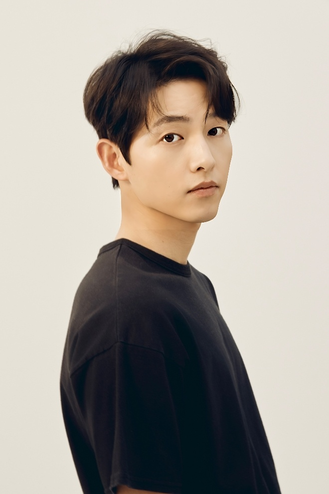
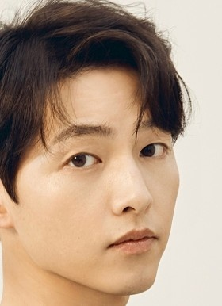

# 📷 Portrait Editor - FaceMesh 기반 얼굴 윤곽 필터 시스템 도입

## ✅ 목적

기존의 사각형 기반 얼굴 영역 마스킹 처리 방식은 정확도가 낮고, 얼굴 외곽(머리카락, 턱선, 옷 경계 등)에서 부자연스러운 블렌딩 현상이 발생하였습니다.

**이를 개선하기 위해 `MediaPipe FaceMesh` 기반의 정밀 얼굴 윤곽 마스크 처리 구조로 리팩토링합니다.**

---

## ❗ 변경하는 이유

### 기존 방식의 문제점

| 문제 | 설명 |
|------|------|
| 🔲 사각형 마스크 한계 | 얼굴이 정사각형이 아니기 때문에 필터 경계에서 이질감 발생 |
| 🎭 얼굴 이외 부위 포함 | 옷, 배경, 머리카락 등이 마스킹에 포함되어 부자연스러운 결과 초래 |
| 🔄 필터 겹침 현상 | 눈·입·피부 필터 간 경계가 맞지 않아 Tone mismatch 현상 발생 |
| ❌ 자연스러운 윤곽 부족 | 헤어 라인 또는 턱 라인 필터 적용 시 부자연스러운 경계 표현 |

### 🎨 전체 이미지 필터 처리 비교

| Before (Original) | After (Filtered) |
|-------------------|------------------|
|  |  |
| 원본 전체 이미지 |기존 필터 적용 후 전체 이미지 결과 |

---

### ✂️ 얼굴 영역 마스크 비교

| Cropped Face (Rect) | Processed Face (Filtered) |
|---------------------|------------------------------------|
|  |  |
| Rect 기반 얼굴 잘라낸 이미지 | 기존 필터 처리된 얼굴 |

### 개선 후 기대 효과

| 개선 항목 | 기대 결과 |
|-----------|-----------|
| ✅ 윤곽 마스크 적용 | 머리부터 턱까지 자연스러운 필터 적용 |
| ✅ 눈·입 영역 보호 | 부위별 필터 정밀 제어 가능 |
| ✅ 경계 부드러움 향상 | feather + 윤곽 마스크 조합으로 경계 흐림 자연스러움 증가 |
| ✅ 향후 확장성↑ | 부위별 보정, AR 효과 적용 등 다양한 처리 흐름과 호환성 확보 |

---

## 🎯 변경 목표

- 얼굴 사각형(Rect)이 아닌, **윤곽선 기반 마스크**를 사용하여 필터 처리
- 얼굴 중심 (머리 ~ 턱선) 영역에만 alpha blending을 적용
- 눈/입/피부 필터 정밀도 향상 및 톤 일관성 확보

---

## 📐 구조 변화

### 기존 구조

- `detectFaceWithHairRegion()` → Rect 기반 crop
- `SelfieSegmentor.segment()` → 배경 분리
- `toSoftAlphaMask(...)` → feather 후 사용
- Rect 마스크 기준으로 필터 적용 및 블렌딩

### 변경 구조

- `MediaPipe FaceMesh` 사용
    - 총 468개 랜드마크 추출
    - 얼굴 윤곽선 polygon 마스크 생성
- `SegmentationMask`와 윤곽 마스크를 **AND 결합**
- 해당 영역에만 필터 및 업스케일링 적용

---

## 🧱 구현 구성 요소

### 1. MediaPipe FaceMesh 적용

- `com.google.mediapipe:facemesh:0.10.20` 의존성 추가
- `FaceMesh.getClient()` 로 얼굴 landmark 획득

---

### 🧪 Example

> MediaPipe FaceMesh로 추출된 얼굴 윤곽 랜드마크 시각화 예시입니다.

---

### 2. 얼굴 윤곽선 마스크 생성

### ✂️ 얼굴 영역 마스크 비교

### 🧪 얼굴 마스크 단계별 비교

| 🧩 Landmark 마스크 | 🧠 Segmentation 마스크 | 🎯 결합 마스크 |
|--------------------|------------------------|----------------|
|  |  |  |
| 얼굴 윤곽선 기반 마스크 | 세그먼트 기반 얼굴+헤어 | 두 마스크 결합 영역 (정밀 필터 영역 확보) | 

테스트 PR입니다
  --
